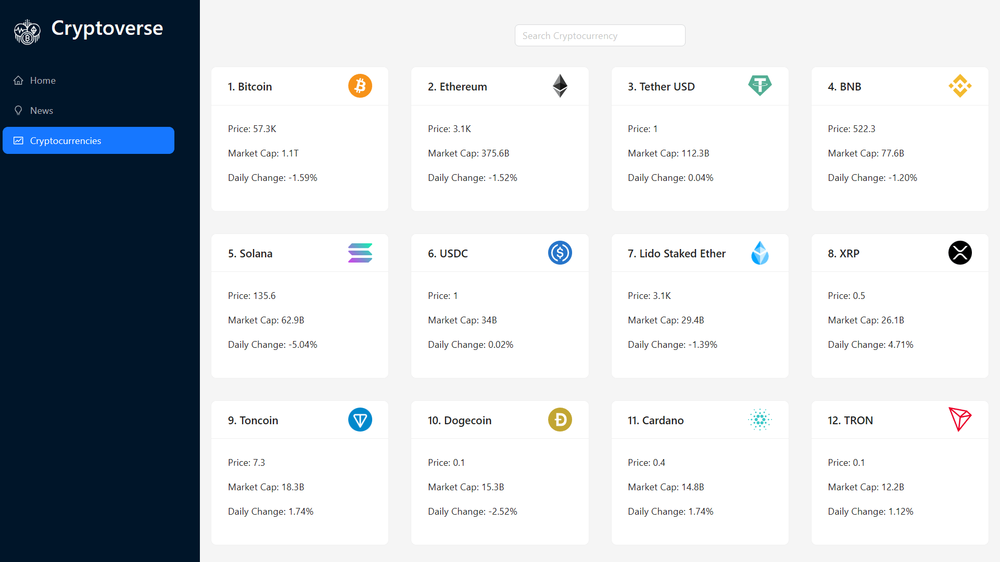

<div align="center">
    <a href="https://cryptodb-fv.netlify.app" target="_blank">
      
    </a>
  <h3 align="center">Cryptocurrency DB</h3>
</div>

##  <br /> 📋 <a name="table">Table of Contents</a>

- ✨ [Introduction](#introduction)
- ⚙️ [Tech Stack](#tech-stack)
- 📝 [Features](#features)
- 🚀 [Quick Start](#quick-start)

##  <br /> <a name="introduction">✨ Introduction</a>

**[EN]** CryptoDB is a React application that integrates RapidAPI for features such as Bing News Search and Crypto Ranking. It utilizes Redux Toolkit for efficient state management, Ant Design for polished UI components, and Chart.js for dynamic data visualization.

**[FR]** CryptoDB est une application React qui intègre RapidAPI pour des fonctionnalités telles que la recherche d'actualités Bing et le classement des cryptomonnaies. Elle utilise Redux Toolkit pour une gestion efficace de l'état, Ant Design pour des composants d'interface utilisateur élégants, et Chart.js pour la visualisation dynamique des données.

##  <br /> <a name="tech-stack">⚙️ Tech Stack</a>

- [**React**](https://react.dev/reference/react)* is a popular JavaScript library for building user interfaces, particularly single-page applications where data changes over time. React's component-based architecture allows developers to create reusable UI components, making development more efficient and the codebase easier to maintain. 

- [**React Redux**](https://react-redux.js.org/introduction/getting-started) is an official Redux library for integrating Redux state management with React applications. It simplifies the process of managing application state by providing predictable state containers and enabling efficient data flow between React components, making it easier to maintain large-scale applications.

- [**Axios**](https://axios-http.com/docs/intro) is a popular JavaScript library used for making HTTP requests from the browser or Node.js. It simplifies the process of sending asynchronous HTTP requests and handling responses, making it easier to interact with APIs and fetch data in web applications.

- [**Chart.js**](https://www.chartjs.org/docs/latest/getting-started/) is a versatile JavaScript library for creating responsive and interactive charts and graphs. It offers a wide range of chart types, customization options, and supports dynamic data updates, making it suitable for visualizing data in web applications with ease.

- [**Ant Design**](https://ant.design/docs/react/getting-started) is a comprehensive UI library for React applications, offering a set of polished and customizable components. It follows design principles for creating modern and accessible user interfaces, providing ready-to-use components like buttons, forms, and layouts that enhance development efficiency and maintain consistency in UI design.

- [**Millify**](https://www.npmjs.com/package/millify) is a lightweight JavaScript library for formatting numbers into readable strings, particularly useful for converting large numbers (such as cryptocurrency values or statistics) into abbreviated formats. It provides functions to convert numbers into million, billion, or trillion formats, improving readability and user experience in data-heavy applications.

- [**Moment**](https://www.npmjs.com/package/moment) is a widely used JavaScript library for parsing, validating, manipulating, and formatting dates and times. It simplifies working with dates and times in web applications by providing an extensive set of functions for operations like parsing dates from strings, formatting dates for display, and calculating durations between dates.


## <br /> <a name="quick-start">🚀 Quick Start</a>

Follow these steps to set up the project locally on your machine.

<br/>**Prerequisites**

Make sure you have the following installed on your machine:

- [Git](https://git-scm.com/)
- [Node.js](https://nodejs.org/en)
- [npm](https://www.npmjs.com/) (Node Package Manager)

<br/>**Cloning the Repository**

```bash
git clone {git remote URL}
```

<br/>**Installation**

Let's install the project dependencies, from your terminal, run:

```bash
npm install
# or
yarn install
```

<br/>**Set Up Environment Variables**

Create a new file named `.env` in the root of your project and add the following content:

```env
# Rapid API 
REACT_APP_RAPIDAPI_KEY=

# Coin Ranking
REACT_APP_CRYPTO_RAPIDAPI_HOST=coinranking1.p.rapidapi.com
REACT_APP_CRYPTO_API_URL=https://coinranking1.p.rapidapi.com

# Bing News Search
REACT_APP_NEWS_RAPIDAPI_HOST=bing-news-search1.p.rapidapi.com
REACT_APP_NEWS_API_URL=https://bing-news-search1.p.rapidapi.com
 
ESLINT_NO_DEV_ERRORS=true
```

Replace the placeholder values with your actual respective account credentials:

- [Rapid API](https://rapidapi.com/hub)
- [Coin Ranking](https://rapidapi.com/Coinranking/api/coinranking1)
- [Bing News Search](https://rapidapi.com/microsoft-azure-org-microsoft-cognitive-services/api/bing-news-search1 )


<br/>**Running the Project**

Installation will take a minute or two, but once that's done, you should be able to run the following command:

```bash
npm start
# or
yarn start
```

Open [`http://localhost:3000`](http://localhost:3000) in your browser to view the project.